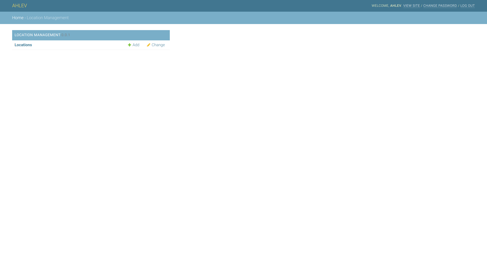

# DJANGO LOCATION APPLICATION
 

This application is to show a location in google map.

## prerequisites
The instructions below assume that you have a django project already set up; and a python virtual environment already installed and activated. 

## styles
All ahlev-django applications are using styles from [mdbootstrap.com](https://mdbootstrap.com), so please make sure you install [ahlev-django-css-js](https://github.com/ohahlev/ahlev-django-css-js.git) first.


## install from this repository
### clone
```
git clone https://github.com/ohahlev/ahlev-django-location.git
```

### go to directory ahlev-django-location
```
cd ahlev-django-location
```

### create installer package
```
python3 setup.py sdist
```

### go to project directory
```
pip install dist/ahlev-django-location-0.0.1.tar.gz
```

## install from pypi
### go to the project directory and install from pypi
[ahlev-django-location](https://pypi.org/project/ahlev-django-location/)

## project configuration
### update settings.py as the following
```
INSTALLED_APPS = [
    'location', # add this line
    ...
]
```

### add these lines to the end of settings.py
```
STATICFILES_DIRS = [
    os.path.join(BASE_DIR, "static")
]
STATIC_URL = '/static/'
MEDIA_ROOT = os.path.join(BASE_DIR, 'uploads')
MEDIA_URL = '/medias/'
```

## screenshots
### frontend: partial location


### backend: location management


### backend: list all locations


### backend: edit a location

